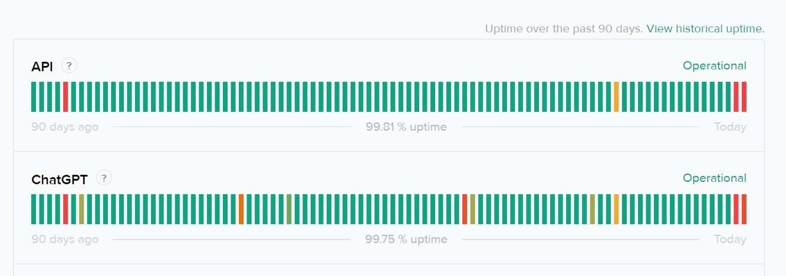

Activate Env:
source chatbot/bin/activate

Deactivate Env:
deactivate

02/14/2024:
Need to Retest, currently issue with API

"We are currently encountering a partial outage on both of our ChatGPT and API platforms; users might experience elevated error rates on the API or have trouble logging in to their accounts. The team is actively working on resolving the issue."

Monitoring - A fix has been implemented and we are monitoring the results.
Feb 14, 2024 - 10:38 PST
Investigating - We are continuing to investigate this issue.
Feb 14, 2024 - 10:20 PST

